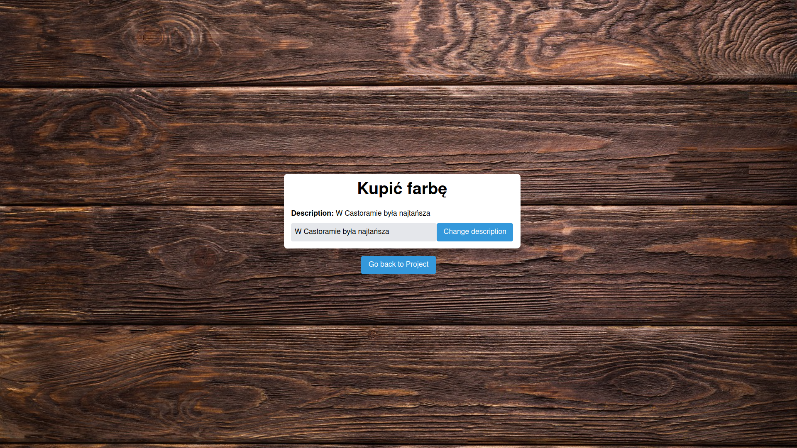

# Project Planner – projekt z PAP
## O aplikacji
Aplikacja Project Planner służy do zarządzania prostymi projektami. Umożliwia utworzenie projektów, dodawanie do niego innych użytkowników oraz przydzielanie im zadań.

### Wygląd




### Technologie
Frontend: interfejs webowy (React)

Backend: Java (Spring + REST)

Baza danych: MySQL

### Funkcje
Strona logowania:

- założenie konta
- zalogowanie się nazwą użytkownika i hasłem
- zalogowanie przy użyciu konta Google

Strona domowa użytkownika:

- wyświetlanie projektów użytkownika z wykorzystaniem stronicowania
- dodawanie i usuwanie projektów
- przejście do strony projektu poprzez kliknięcie w jego nazwę
- zmiana nazwy użytkownika

Strona projektu:
- wyświetlanie członków projektu z wykorzystaniem stronicowania
- dodawanie i usuwanie członków projektu
- zmiana opisu projektu
- wyświetlanie zadań z wykorzystaniem stronicowania
- dodawanie i usuwanie zadań
- odznaczanie wykonanych zadań

Strona zadania:

- zmiana opisu zadania

## Członkowie zespołu
- Piotr Lenczewski
- Michał Machnikowski
- Jakub Pęk
- Tomasz Truszkowski

## Uruchamianie
### Zmienne środowiskowe – dane dostępowe
```sh
export DB_HOST=… DB_PORT=… DB_NAME=… DB_USER=… DB_PASSWORD=…
```

### MySQL
#### Testowanie połączenia
```sh
pip install mysql-connector-python
```

```sh
python src/check_db_connection.py
```

### Spring backend
#### Budowanie
```sh
mvn package
```

#### Uruchomienie
```sh
java -jar target/pap-app-1.0.0.jar
```

API jest dostępne na: <http://localhost:8080/api/>

### React frontend
#### Instalacja zależności
```sh
cd src/my-react-frontend
npm install
```

#### Uruchomienie
```sh
cd src/my-react-frontend
npm start
```

Strona jest dostępna na: <http://localhost:3000/>

