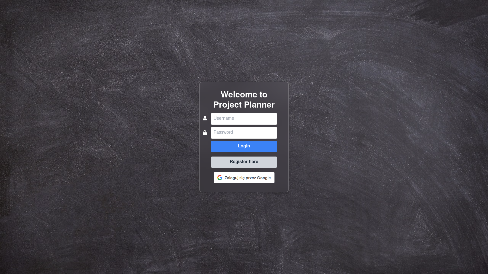
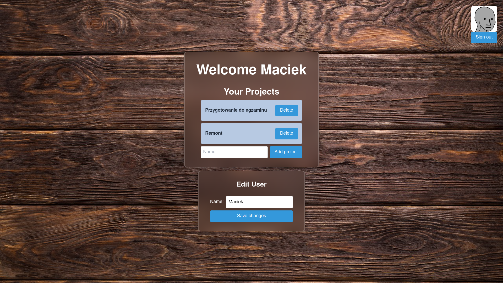
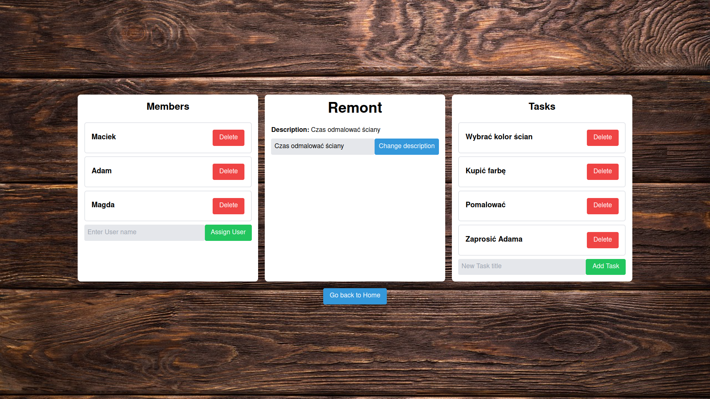
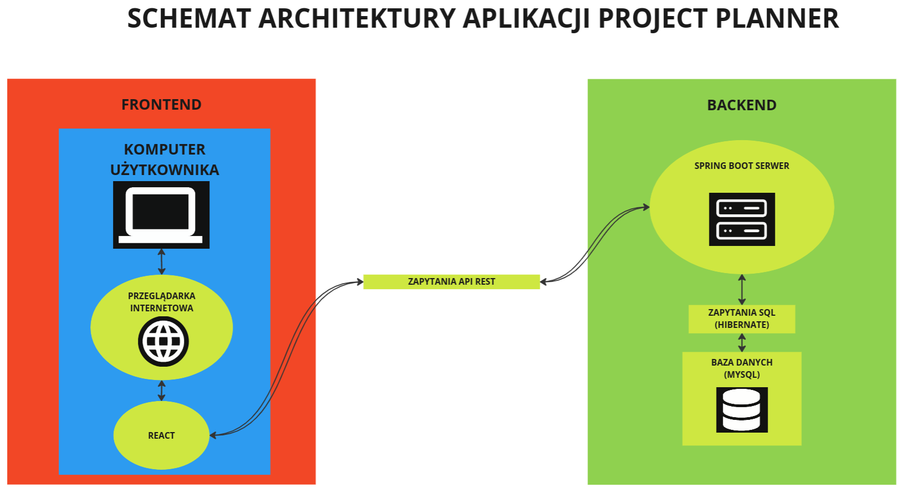

# Project Planner
## Członkowie zespołu
- Piotr Lenczewski
- Michał Machnikowski
- Jakub Pęk
- Tomasz Truszkowski

## O aplikacji
Aplikacja Project Planner służy do zarządzania prostymi projektami. Umożliwia utworzenie własnego projektu, dodawanie do niego innych użytkowników oraz przydzielanie im zadań.

### Wygląd

## Lista funkcjonalności
Strona startowa:
- rejestracja nowego użytkownika
- logowanie
- logowania przy użyciu konta google

Strona domowa użytkownika:
- wyświetlanie nazwy użytkownika oraz maila jeżeli jest w bazie danych
- zmiana nazwy użytkownika
- wyświetlanie projektów których użytkownik jest członkiem z wykorzystaniem stronnciowania
- dodawanie nowego projektu
- usuwanie projektu
- przejście do strony projektu poprzez kliknięcie w nazwę projektu
- wylogowanie

Strona projektu:
- wyświetlanie nazwy oraz opisu projektu
- zmiana opisu projektu
- wyświetlanie członków projektu z wykorzytsaniem stronnicowania
- dodawanie użytkowników do projektu poprzez podanie nazwy użytkownika znajdującego się w bazie danych
- usuwanie użytkownika z projektu
- wyświetlanie zadań z wykorzytsaniem stronnicowania
- dodawanie zadań
- możliwość zaznaczenia zadania jako wykonane
- usuwanie zadań
- przejśćie do strony zadania poprzez kliknięcie nazwy zadania

Strona zadania:
- wyświetlanie nazwy oraz opisu zadania
- zmiana opisu zadania

## Architektura aplikacji

