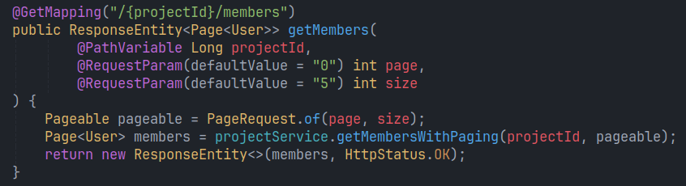
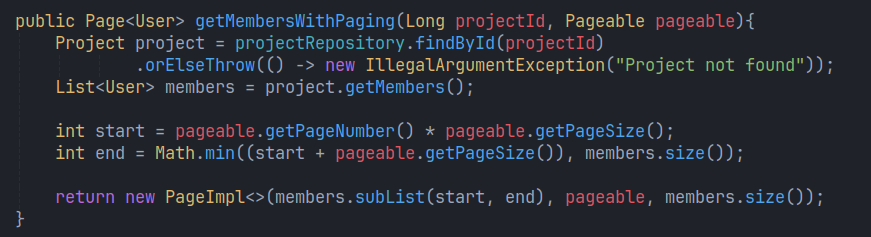
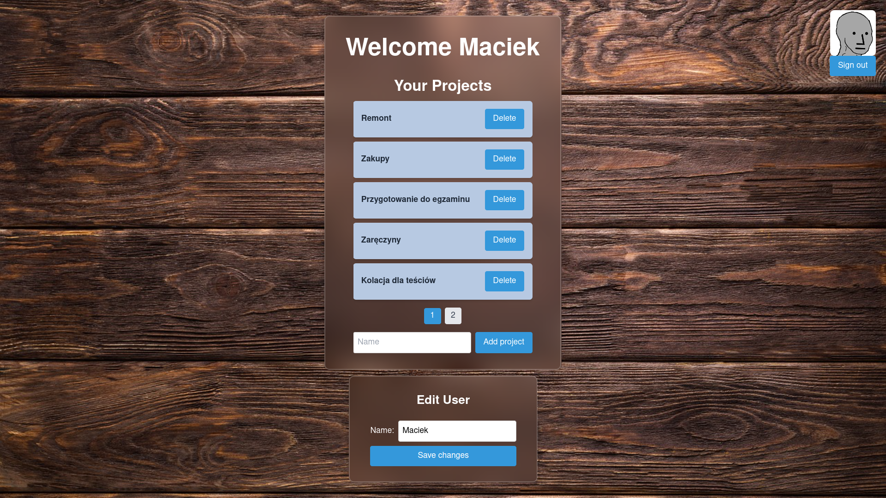
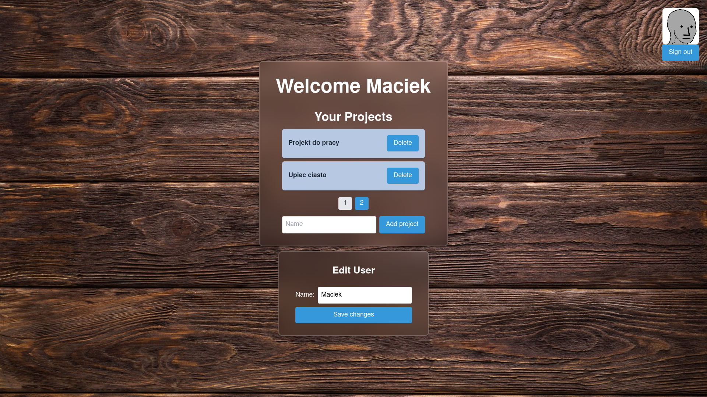
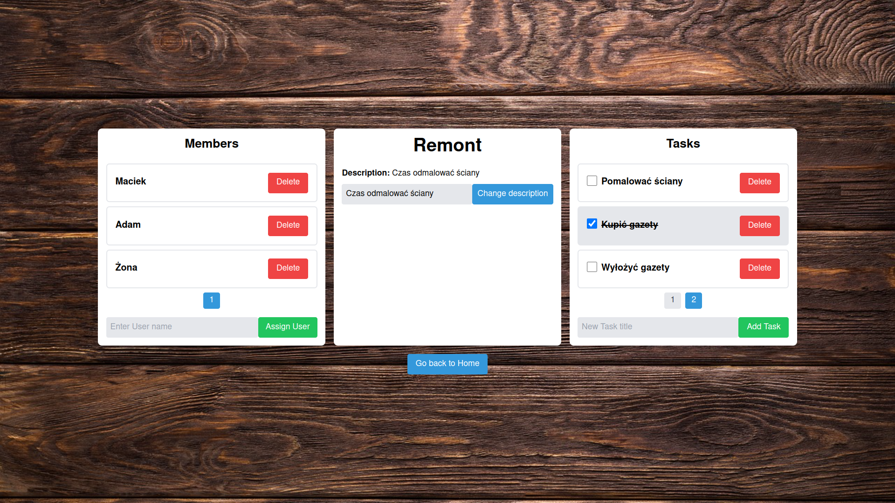

# Project Planner
## Członkowie zespołu
- Piotr Lenczewski
- Michał Machnikowski
- Jakub Pęk
- Tomasz Truszkowski

## O aplikacji
Aplikacja Project Planner służy do zarządzania prostymi projektami. Umożliwia utworzenie projektów, dodawanie do niego innych użytkowników oraz przydzielanie im zadań.

### Wygląd

## Lista funkcjonalności
Strona logowania:

- rejestracja nowego użytkownika
- zalogowanie się
- zalogowanie przy użyciu konta Google

Strona domowa użytkownika:

- wyświetlanie nazwy użytkownika (oraz adresu e-mail w przypadku zalogowania kontem Google)
- zmiana nazwy użytkownika
- wyświetlanie projektów, których użytkownik jest członkiem z wykorzystaniem stronicowania
- dodawanie nowego projektu
- usuwanie projektu
- przejście do strony projektu poprzez kliknięcie w jego nazwę
- wylogowanie się

Strona projektu:

- wyświetlanie nazwy oraz opisu projektu
- zmiana opisu projektu
- wyświetlanie członków projektu z wykorzystaniem stronicowania
- dodawanie użytkowników do projektu poprzez podanie nazwy istniejącego użytkownika
- usuwanie użytkownika z projektu
- wyświetlanie zadań z wykorzystaniem stronicowania
- dodawanie zadań
- możliwość zaznaczenia zadania jako wykonane
- usuwanie zadań
- przejście do strony zadania poprzez kliknięcie nazwy zadania

Strona zadania:

- wyświetlanie nazwy oraz opisu zadania
- zmiana opisu zadania

## Architektura aplikacji

## Poprawki
Dodane funkcjonalności:

- paginacja po stronie serwera
- strona tasku
- zaznaczanie tasku jako wykonanego

